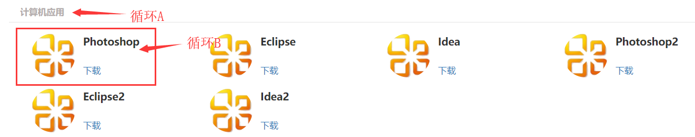

### 配置环境  

M:怎么配置视图解析器呢？

Z:1.在springmvc.xml中添加了包扫描器和补全内容。springmvc就会自动去扫描该包下的类，执行其对应方法。    

```java
	<context:component-scan base-package="cn.kemao666.controller" />
	<mvc:annotation-driven />
	<bean
		class="org.springframework.web.servlet.view.InternalResourceViewResolver">
		<property name="prefix" value="/WEB-INF/jsp/" />
		<property name="suffix" value=".jsp" />
	</bean>
```

2. 使用：Controller部分添加注解接收访问

   ```java
   @Controller
   @RequestMapping("/majorSoft")
   public class MajorSoftController {
   	@RequestMapping("toMajorSoft")
   	public String toMajorSoft(){
   		return "home/majorSoft";
   	}
   }
   ```

   跳转页面不能添加``@ResponBody``注解


### 学习软件页面显示   

D:现在要实现的就是使用bootstrap把静态的软件列表展示做出来。

Z:首先是要将通用的js提取出来。

M:要引入js文件，最好使用动态获取的绝对路径，但是怎么获取到当前文件的路径呢？

Z:使用request获取到地址，并且存入kcat中，jsp中就可以通过``${kcat}``拿到。

```html
<%pageContext.setAttribute("kcat", request.getContextPath());%>   
```

M:但是为什么我测试打印不出地址呢？

Z:1. 通过ip得到jsp不是tomcat的默认页面。所以获取字符串为空，它获得的是虚目录。

2. 也可以通过``<c:set var="ctxStatic" value="${pageContext.request.contextPath}/static"/>``设置。
3. 通过``${pageContext.request.contextPath}``也能直接获取到，这里暂时使用最简单的方法。


M:要怎么EL嵌套循环呢？

  

Z:传标题List和软件List过来，软件List需要两层

```java
	@RequestMapping("/majorSoft")
	public String showPage(Model model){
		ArrayList<String> major = new ArrayList<String>();
		major.add("计算机应用");
		major.add("计算机网络");
		model.addAttribute("major", major);

		
		ArrayList<ArrayList<String>> softwareLists = new ArrayList<ArrayList<String>>();
		
		ArrayList<String> softwareList = new ArrayList<String>();
		softwareList.add("Photoshop");
		softwareList.add("Eclipse");
		softwareList.add("Idea");
		softwareLists.add(softwareList);
		ArrayList<String> softwareList2 = new ArrayList<String>();
		softwareList.add("Photoshop2");
		softwareList.add("Eclipse2");
		softwareList.add("Idea2");
		softwareLists.add(softwareList2);

		model.addAttribute("softwareLists", softwareLists);
		return "home/majorSoft";
	}	
```

然后前端用EL进行对应的解析：

```html
		<div class="col-md-10">
			<c:forEach items="${major}" var="item" varStatus="i"> 
			<div class="typeName">${item}</div>   <!-- 大标题 -->
				<div class="row">
					<c:forEach begin="1" end="${softwareLists.get(i.count-1).size()}" var="software"  varStatus="j" step="1"> 
						<div class="col-md-3">
							<div class="col-md-4">
								
							</div>
							<div class="col-md-8">
								<p class="title">${softwareLists.get(i.count-1).get(j.count-1) }</p>
								</br>
								<a class="down_btn">下载</a>
							</div>
						</div>
					</c:forEach>  
				</div>
			</c:forEach>
```

M:为什么我指定里边的资源，一直显示不出来，console报错``GET http://localhost:8080/jsp/backstage/css/bootstrap-maizi.css net::ERR_ABORTED``    

Z:主要是因为资源映射没有配置好，在xml文件中配置指定的资源位置ssm才能访问到

```xml
	<!-- 后台资源映射 -->
	<mvc:resources location="/WEB-INF/jsp/backstage/css/" mapping="/jsp/backstage/css/**"/>
```


Z：注意，旧的  bigtype ， freemooc，type 三个表的id还是用int


